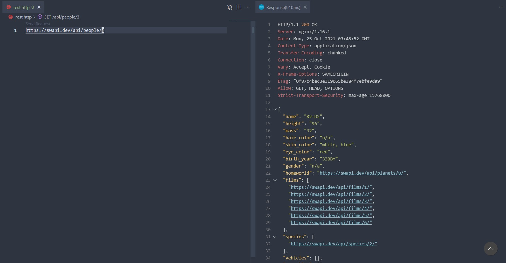

# Rest Client and curl
The other alternatives to request testing with Postman are REST Client Extension and curl command. If you are the person that get boring of open Postman while testing REST API, I recommend REST Client Extension in vscode.

## Rest Client Extension
After downloading this extension, you can start creating request file with .http extension.

```
// rest.http
https://swapi.dev/api/people/3
```
You can use either .http or .txt, but the REST Client extension can detect .http and pop up the "Send Request" message. Therefore, it is more convenient to use .http than .txt.

For .txt, you need to run command palette (Ctrl + Shift + P) and use "REST Client: Send Request".

### Basic Syntax
- use `###` to separate requests
- both lowercase and uppercase are allowed for request type (POST or post)

### GET request
```
https://swapi.dev/api/people/3

### separate between request

GET https://swapi.dev/api/planets/3/

### or

get https://swapi.dev/api/planets/3/
```

### Post request
```
POST https://example.com/comments HTTP/1.1
Content-Type: application/xml
Authorization: token xxx

<request>
    <name>sample</name>
    <time>Wed, 21 Oct 2015 18:27:50 GMT</time>
</request>

### send json body

POST https://example.com/comments HTTP/1.1
Content-Type: application/json

{
    "userId": "123",
    "name": "Chitsaunpong"
}

```
### Variables
```
@hostname = https://swapi.dev/api

{{hostname}}/people/3

###

GET {{hostname}}/planets/3/
```

## Fake API resources
- [JSON Placeholder](https://jsonplaceholder.typicode.com/)
- [The Star Wars API](https://swapi.dev/)

## curl command
cURL stands for client URL which is a command line tool that be used to transfer data to and from a server.
Syntax:
```
curl <OPTION> <URL>
```

### GET request
```
curl http://localhost:5000/comments

// show header
curl -i http://localhost:5000/comments
curl --head http://localhost:5000/comments

```
### Show Header

### Downloading files HTTP
- `-o <FILE_NAME>` - download file and paste in a new file.
- `-O` - download file and auto create a file with endpoint name (file name is not required).
- `-#` - change download progress to progress bar
```
curl -o comments.txt http://localhost:5000/comments
curl -# -O http://localhost:5000/comments
curl -O --limit-rate 1000B https://jsonplaceholder.typicode.com/Flowdash-logo-text.png
```

### Download/Upload files FTP
```
// format
curl -u "user:password" <URL>

// Download
curl -u neverrest:823454 -O file.txt ftp://ftp.neverrest.com

// Upload
curl -u neverrest:823454 -T file.txt ftp://ftp.neverrest.com

```

### Headers
```
curl -H "Content-Type: application/json" -H "Accept: application/json" [URL]
```

### POST Request
```
// basic
curl --data "body=dazzling command&postId=2" http://localhost:5000/comments

// send json body
curl -H "Content-Type: application/json" -d '{"body":"Dazzling Comment","postId":2}' http://localhost:5000/comments

// send json body with json file
curl -X POST -H "Content-Type: application/json" -d @data.json http://localhost:5000/comments

```

### Reference
- [cURL คืออะไร? + มาหัดใช้กันเถอะ](https://devahoy.com/blog/2016/11/getting-started-with-curl/)
- [Basic cURL Tutorial](https://www.youtube.com/watch?v=7XUibDYw4mc&t=328s)